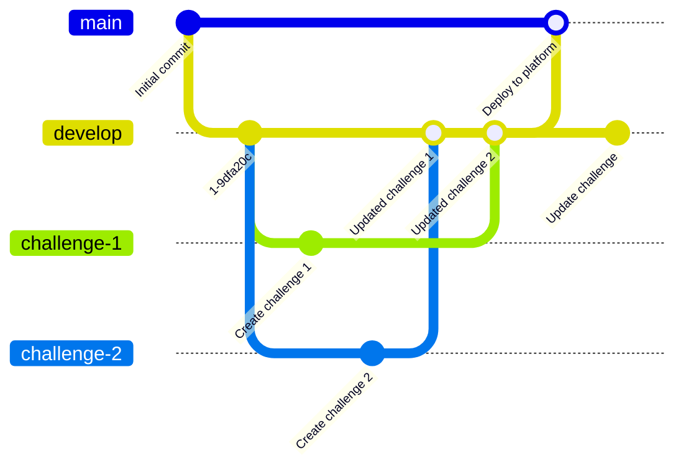

# Challenge Repository Template

## Template

> [!IMPORTANT]
> The [`Template`](#template) section must be removed after you have created a repository from this template.  
> This section serves only to inform you on how to use this template.

This repository serves as a template for creating new challenge repositories in the CTF Pilot ecosystem.  
It includes the necessary structure, workflows, and tools to streamline challenge development and deployment.

### How to Use This Template

1. **Create a New Repository**:
   - Click the "Use this template" button on the repository page.
   - Name your new repository and configure its visibility.

2. **Allow pipeline to create pull requests**:
   - Go to the "Settings" tab of your new repository.
   - Select "Actions" > "General".
   - Check the box for "Allow GitHub Actions to create and approve pull requests".

3. **Clone the New Repository**:
   - Clone your newly created repository to your local machine using Git.
 
4. **Remove the Template Section**:
   - Open the `README.md` file in your new repository.
   - Remove the entire `Template` section to avoid confusion.

5. **Insert repository name (`owner/repo`) in the README.md file**:
   - In the `README.md` file, replace all instances of `ctfpilot/challenges-template` with your new repository's name in the format `owner/repo`. (Use find and replace feature of your text editor).

### Included Features

Included in this template are the following tools and configurations:

- [CTF Pilot's Challenge Toolkit](https://github.com/ctfpilot/challenge-toolkit) v1.0
- [CTF Pilot's Challenge CI](https://github.com/ctfpilot/challenge-ci) v1.0

The tools are configured to work out-of-the-box, enabling you to focus on challenge development rather than setup.  
However, for advanced customization, refer to the documentation of each tool.

#### Discord bot integration

[CTF Pilot's Discord Bot](https://github.com/ctfpilot/discord-bot) can be integrated with this repository.  
However, this README does not provide instructions to challenge developers on how it can be used to do some of the automation.

Refer to the [Discord Bot documentation](https://github.com/ctfpilot/discord-bot) for more information on how to set up and use the bot with your challenge repository.

### Template license

The template repository is licensed under the [EUPL-1.2 License](https://interoperable-europe.ec.europa.eu/sites/default/files/custom-page/attachment/2020-03/EUPL-1.2%20EN.txt).  
The included tools are licensed under their respective licenses.

By contributing to this template repository, you agree to our Contributor License Agreement (CLA).  
The CLA can be found in <https://github.com/ctfpilot/cla>.

You may copy, modify, and distribute this template repository under the terms of the [EUPL-1.2 License](https://interoperable-europe.ec.europa.eu/sites/default/files/custom-page/attachment/2020-03/EUPL-1.2%20EN.txt).  
Any content you add to your new repository, that is templated from this repository, is subject to your own licensing terms.

A license file is not included in this template repository to avoid confusion.

## Repository structure

> [!TIP]
> Challenges are located in the [`challenges/`](./challenges/) directory.

The repository is structured as follows:

```txt
.
├── challenge-toolkit/
├── challenges/
│   ├── web
│   ├── forensics
│   ├── rev
│   ├── crypto
│   ├── pwn
│   ├── boot2root
│   ├── osint
│   ├── misc
│   ├── blockchain
│   └── beginner/
│       └── challenge-1
├── pages/
│   └── page-1/
├── template/
└── <other files>
```

Inside the `challenges` directory, challenges are divided into categories.  
Each challenge is stored in its own directory, named identically to the challenge slug.

### Challenge structure

> [!TIP]
> Challenge source code is located in the `src/` directory.  
> The main files are `challenge.yml`, `description.md` and `README.md`.

Each challenge is stored in its own directory, named identically to the challenge slug.
Within the challenge directory, there are several subdirectories and files that make up the challenge.

The subdirectory structure of a challenge is as follows:

```txt
.
├── handout/
├── k8s/
├── solution/
├── src/
├── template/
├── challenge.yml
├── description.md
├── README.md
└── version
```

- `handout/`contains the files that are handed out to the user. This may be the binary that needs to be reversed, the pcap file that needs to be analyzed, etc. The files in this directory are automatically zipped and stored in the `k8s/files/` directory as `<category>_<slug>.zip`.
- `k8s/` contains the kubernetes deployment files for the challenge. This is automatically generated and used for deploying to the CTF platform. This directory should not be modified manually.
- `solution/` contains the script that is used to solve the challenge. This is filled out by the challenge creator. No further standard for the content is enforced.
- `src/` contains the source code for the challenge. It contains all the code needed for running the challenge. It may also contain any copies that needs to be handed out. Dockerfiles, python scripts, etc. lives here.
- `template/` contains the template files for the challenge. For example the kubernetes deployment files, or similar, that are rendered with the data from the `challenge.yml` file.
- `challenge.yml` contains the metadata for the challenge. This must be filled out by the challenge creator. Follows a very strict structure, which can be found in the schema file provided in the file.  
  The file may be replaced by a JSON file, as `challenge.json`.
- `description.md` contains the description of the challenge. This is the text that is shown to the user, when they open the challenge. It should be written in markdown.
- `README.md` contains the base idea and information of the challenge. May contain inspiration or other internal notes about the challenge. May also contain solution steps.
- `version` contains the version of the challenge. This is automatically updated by the CI pipeline, when a new version is released.

To learn more about the `challenge.yml` file, see the [CTF Pilot's Challenge Schema](https://github.com/ctfpilot/challenge-schema).

### Git: Branch flow

> [!TIP]
> When developing a challenge, it is recommended to create a new branch for the challenge.  
> The flow for a challenge will look as such: `develop` -> `challenge/<challenge-slug>` -> `develop` -> `main`.

The project uses Git and Github til manage the challenges.

The repository uses two primary branches, `main` and `develop`.  
`develop` is the default branch, and are open for all to push to. However, we recommend that you branch out into your own branch, to make your challenge.  
`main` is the branch that is used for the live CTF, and should only be updated by the maintainers of the CTF. Data stored here, will be synced into the CTF platform.

Flow visualization:



## Developing a challenge

> [!TIP]
> The development process can be broken down into the following steps:
> 1. Create a new challenge using the [Create challenge](#create-a-challenge) tool.
> 2. Develop the challenge in the `challenge/<challenge-slug>` branch.
> 3. Push the changes to the branch.
> 4. Request a review of the PR.
> 5. Merge the PR into `develop` when a review has been done.
> 6. Merge `develop` into `main` when the challenge is ready for the CTF platform.

All challenges must fit into the structure described in the [Challenge structure](#challenge-structure) section.

If it is your first time developing a challenge, please read the entire section before starting the development process.

The challenge development process is as follows:

1. Create a new challenge based on the [Create challenge](#create-a-challenge) section.
   - TL;DR: Use the [Create challenge Github action](https://github.com/ctfpilot/challenges-template/actions/workflows/create-chall.yml) to create a new challenge.
2. Update the generated issue with the challenge information.
   - The description of the issue with relevant information about the challenge.
3. Checkout the branch created by the Github action locally
   - Clone the repository and switch branch to the new branch:
   - `git clone https://github.com/ctfpilot/challenges-template`
   - `cd ctfpilot/challenges-template`
   - `git checkout challenge/<challenge-slug>`
4. Develop the challenge.
   - Develop your challenge, by adding the files needed in the `src/` and `handout/` directory.
   - Update challenge metadata in the `challenge.yml`.
   - Write the challenge description in `description.md`.
   - Write the general information about the challenge in `README.md`.
   - Write a solvescript and document steps to solve the challenge in `solution/`
   - If the challenge is a shared og instanced challenge, customize the deployment files in the `template/` directory.
5. Push the changes to the branch.
   - It is recommended to this regularly, to ensure that the data is not lost.
6. Request a review of the PR.
   - If the challenge is either shared og instanced, coordinate with the infrastructure team to get a review of the challenge.
7. Merge the PR into `develop`.
   - This should be done, when you feel comfortable with the challenge, and a review has been done.
8. You have done it! Challenge is now at a stage, where it is ready to come on the CTF platform.
   - The challenge can now be deployed to staging (if applicable), and later to production.
9. To release the challenge to production, merge `develop` into `main`.
   - This should be done by the maintainers of the infrastructure.

If you want to update the challenge, you can do so by repeating the process descriped above, but instead of creating a new challenge, you should create a new branch for the challenge based on the `develop` branch.  
Read more about this in the [Git: Branch flow](#git-branch-flow) section.

Challenges are automatically versioned to allow for easy updates and tracking of changes.

Large files should *never* be commited to the repository. If you need to add a large file, please reach out to the infrastructure team, so that they can help you with the process.  

> [!CAUTION]
> Large files should *never* be commited to the repository.  
> If a large file is commited to the repository, it needs to be downloaded by **everyone** that clones the repository, regardless of it being deleted in the future.

*If you have ***no*** experience with Git, please reach out to the infra team for help.*  
*The infra team may also be able to stuff your challenge into the format, if you have developed outside of the structure. But give it a try yourself first.*

### Create a challenge

To create a new challenge, you can use the provided Github action workflow: [`Create challange`](https://github.com/ctfpilot/challenges-template/actions/workflows/create-chall.yml).

This workflow can be found in the [`Actions`](https://github.com/ctfpilot/challenges-template/actions/workflows/create-chall.yml) tab of the repository.

The workflow automatically creates a new challenge, with the necessary structure and files, including a branch, pull request and issue for tracking the challenge development.

To create a new challenge, follow these steps:

1. Go to the [`Actions`](https://github.com/ctfpilot/challenges-template/actions/workflows/create-chall.yml) tab of the repository.
2. Select the [`Create challange`](https://github.com/ctfpilot/challenges-template/actions/workflows/create-chall.yml) workflow from the left sidebar.
3. Click the `Run workflow` button.
4. Fill out the required inputs:
   - `Existing issue` (optional): If you have already created an issue for the challenge, you can provide the issue number here. Otherwise, leave it blank to create a new issue.
   - `Name`: The name of the challenge.
   - `Author`: The author of the challenge. This can be your name or alias.
   - `Category`: The category of the challenge. A dropdown provides the available categories.
   - `Difficulty`: The difficulty of the challenge. A dropdown provides the available difficulties.
   - `Type`: The type of the challenge. Possible values are:  
     `static`: Challenge may have a handout but requires no remote.  
     `shared`: Challenge is hosted on a shared instance, which is shared among all players.  
     `instanced`: Challenge is hosted on an individual instance per team/player.
   - `Instaced type` (optional): If the challenge type is `instanced`, you can provide the type of instance, such as web or tcp.
   - `Flag`: The flag for the challenge. Remember to follow the flag format.
   - `Minimum points`: The minimum points for the challenge. This is used for dynamic scoring.
   - `Maximum points`: The maximum points for the challenge. This is used for dynamic scoring.
5. Click the `Run workflow` button to create the challenge.
6. Wait for the workflow to complete. This may take a few moments.
7. Once the workflow is complete, a new branch, pull request, and issue will be created for the challenge.

If errors occur during the workflow execution, please reach out to the infrastructure team for assistance. Logs from the workflow can be found in the `Actions` tab of the repository.
